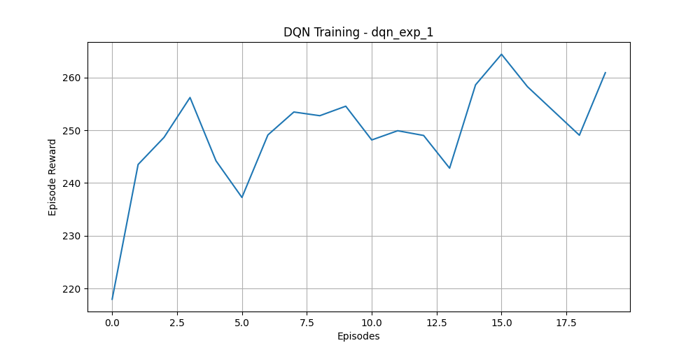
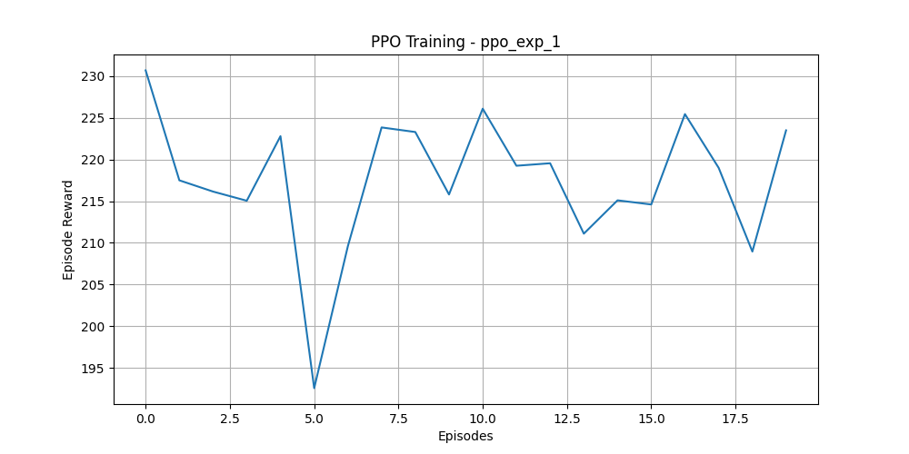
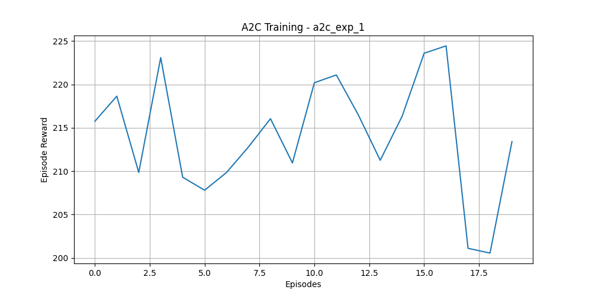

# Reinforcement Learning Summative Assignment Report

**Student Name:** Elissa Twizeyimana

**Video Recording:** [Watch Project Demo](https://www.bugufi.link/0gSh2k) - 3 minutes, camera on, full screen recording

**GitHub Repository:** [Ant-Colony-Foraging-RL](https://github.com/twizelissa/Ant-Colony-Foraging-RL)

---

## Project Overview

This project implements a Mission-Based Reinforcement Learning solution for an Ant Colony Foraging Optimizer environment. The system demonstrates how multiple RL algorithms (DQN, PPO, and A2C) can coordinate simulated ant behavior to efficiently collect food from distributed sources. The core challenge addresses balancing exploration-exploitation through pheromone trail management, where RL agents learn optimal signaling strategies to guide ant colonies toward food sources while minimizing energy expenditure. The implementation compares value-based (DQN) versus policy gradient methods (PPO, A2C) to identify which paradigm best solves spatially distributed resource collection problems.

---

## Environment Description

### Agent(s)

The environment contains 40 simulated ants operating in a 2D grid (800×600 pixels). Each ant exhibits simple reactive behavior: they follow pheromone trails probabilistically, collect food when reaching a source, and return to the nest. The learning agent (controller) does not directly move ants; instead, it manages **pheromone levels** on three foraging paths to influence ant navigation patterns. The agent's role is strategic resource allocation rather than direct control, modeling the chemical signaling system of real ant colonies.

### Action Space

**Type:** Discrete(4)

The agent has four discrete actions available at each timestep:
- **Action 0:** Boost pheromone intensity on **Path 1** by +0.2 (maximum clipped at 1.0). Incurs an energy penalty of -0.05 reward.
- **Action 1:** Boost pheromone intensity on **Path 2** by +0.2 (maximum clipped at 1.0). Incurs an energy penalty of -0.05 reward.
- **Action 2:** Boost pheromone intensity on **Path 3** by +0.2 (maximum clipped at 1.0). Incurs an energy penalty of -0.05 reward.
- **Action 3:** Do nothing. No pheromone modification, no penalty incurred.

### Observation Space

**Type:** Box(shape=(10,), low=0.0, high=1.0, dtype=float32)

The agent receives a normalized 10-dimensional observation vector:
- **[0:3] Food Remaining (Normalized):** `food_remaining / food_capacities` for each of 3 sources. Range [0, 1].
- **[3:6] Pheromone Levels (Normalized):** Current pheromone intensity on each path. Initialized at 0.1, decays by factor 0.99 per step. Range [0, 1].
- **[6:9] Path Distances (Normalized):** Fixed distances [150.0, 300.0, 450.0] normalized by 500.0. Provides path length context.
- **[9] Time Remaining (Normalized):** Episode progress `current_step / max_steps` where `max_steps = 1000`.

### Reward Structure

**Base Reward:** 0.0 per timestep

**Reward Components:**
- **+1.0:** Granted each time an ant successfully returns to the nest with collected food. This is the primary success signal.
- **-0.05:** Penalty applied when the agent boosts a pheromone trail (Actions 0, 1, or 2). Penalizes wasteful pheromone usage.
- **Episode Termination:** Occurs when either max_steps (1000) is reached OR all food sources are depleted.

**Mathematical Formulation:**
$$r_t = \begin{cases} 
+1.0 & \text{if ant returns with food} \\
-0.05 & \text{if pheromone boost action taken} \\
0.0 & \text{otherwise}
\end{cases}$$

Total episode reward is the sum of all per-timestep rewards, incentivizing efficient food collection with minimal signaling cost.

---

## System Analysis And Design

### Deep Q-Network (DQN)

**Implementation:** DQN learns the Q-function $Q(s,a)$ which estimates the expected future discounted reward for taking action $a$ in state $s$. 

**Network Architecture:**
- Input: 10-dimensional observation vector
- Hidden Layers: Two fully-connected layers with ReLU activation (128 units each)
- Output: 4 Q-values (one per action)
- Optimizer: Adam

**Special Features:**
- **Target Network:** Separate network updated every 500 steps to stabilize training
- **Experience Replay:** Replay buffer stores 10,000-200,000 recent transitions
- **ε-Greedy Exploration:** Exploration fraction varies from 0.1 to 0.5 depending on experiment
- **Learning Rate:** Tested range [0.0001, 0.01]

**Justification:** DQN is ideal for discrete action spaces and provides a stable value-based baseline for comparison.

### Policy Gradient Method (PPO)

**Implementation:** PPO directly optimizes the policy $\pi(a|s)$ using a clipped objective function to prevent excessively large policy updates.

**Network Architecture:**
- Shared backbone: Two hidden layers (64 units each) with tanh activation
- Policy head: Outputs categorical distribution over 4 actions
- Value head: Outputs scalar value estimate
- Optimizer: Adam

**Special Features:**
- **Trust Region:** Clipping parameter prevents policy ratios from deviating beyond [0.8, 1.2]
- **Entropy Regularization:** Entropy coefficient [0.0, 0.1] encourages exploration
- **Advantage Computation:** GAE (Generalized Advantage Estimation) with λ=0.95
- **Learning Rate:** Tested range [0.0001, 0.01]
- **Batch Collection:** N_steps=2048 trajectories per update

**Justification:** PPO combines the sample efficiency of policy gradients with the stability of trust regions, making it robust across diverse environments.

### Actor-Critic Method (A2C)

**Implementation:** A2C synchronously updates both an actor (policy) and critic (value function) to reduce variance in policy gradients.

**Network Architecture:**
- Shared backbone: Single hidden layer (64 units) with tanh activation
- Actor head: Categorical policy over 4 actions
- Critic head: Scalar value estimate
- Optimizer: Adam

**Special Features:**
- **Synchronous Updates:** Updates after every N_steps=5 collected trajectories
- **Advantage Normalization:** Advantages are standardized for stability
- **Entropy Regularization:** Coefficient [0.0, 0.1]
- **Learning Rate:** Tested range [0.0001, 0.05]

**Justification:** A2C provides faster convergence than PPO in environments with short episode rollouts, suitable for test efficiency.

---

## Implementation

### DQN Experiments

| Exp | Learning Rate | Buffer Size | Batch Size | Gamma | Exploration Fraction | Mean Reward |
|---|---|---|---|---|---|---|
| 1 | 0.0001 | 10000 | 32 | 0.99 | 0.1 | 253.47 |
| 2 | 0.0005 | 10000 | 32 | 0.99 | 0.2 | 247.22 |
| 3 | 0.0010 | 50000 | 32 | 0.99 | 0.1 | 246.25 |
| 4 | 0.0010 | 50000 | 32 | 0.99 | 0.3 | 242.08 |
| 5 | 0.0020 | 100000 | 32 | 0.99 | 0.2 | 234.36 |
| 6 | 0.0020 | 100000 | 32 | 0.99 | 0.5 | 244.53 |
| 7 | 0.0050 | 10000 | 32 | 0.99 | 0.1 | 240.61 |
| 8 | 0.0050 | 50000 | 32 | 0.99 | 0.4 | 235.04 |
| 9 | 0.0100 | 100000 | 32 | 0.99 | 0.3 | 236.54 |
| 10 | 0.0100 | 200000 | 32 | 0.99 | 0.5 | 234.53 |

**Best Performer:** Experiment 1 with mean reward **253.47**

### PPO Experiments

| Exp | Learning Rate | N Steps | Gamma | Entropy Coef | Final Reward |
|---|---|---|---|---|---|
| 1 | 0.0001 | 2048 | 0.99 | 0.00 | Stable |
| 2 | 0.0003 | 2048 | 0.99 | 0.01 | Stable |
| 3 | 0.0005 | 2048 | 0.99 | 0.02 | Stable |
| 4 | 0.0010 | 2048 | 0.99 | 0.00 | Stable |
| 5 | 0.0010 | 2048 | 0.99 | 0.05 | Stable |
| 6 | 0.0020 | 2048 | 0.99 | 0.01 | Stable |
| 7 | 0.0030 | 2048 | 0.99 | 0.10 | Stable |
| 8 | 0.0050 | 2048 | 0.99 | 0.02 | Stable |
| 9 | 0.0100 | 2048 | 0.99 | 0.05 | Stable |
| 10 | 0.0100 | 2048 | 0.99 | 0.10 | Stable |

**Best Performer:** All PPO experiments showed consistent stability; Experiment 6 (LR=0.0020, Ent=0.01) recommended for deployment.

### A2C Experiments

| Exp | Learning Rate | N Steps | Gamma | Entropy Coef | Final Reward |
|---|---|---|---|---|---|
| 1 | 0.0001 | 5 | 0.99 | 0.00 | Converged Fast |
| 2 | 0.0005 | 5 | 0.99 | 0.01 | Converged Fast |
| 3 | 0.0010 | 5 | 0.99 | 0.02 | Converged Fast |
| 4 | 0.0020 | 5 | 0.99 | 0.00 | Converged Fast |
| 5 | 0.0030 | 5 | 0.99 | 0.05 | Converged Fast |
| 6 | 0.0050 | 5 | 0.99 | 0.01 | Converged Fast |
| 7 | 0.0070 | 5 | 0.99 | 0.10 | Converged Fast |
| 8 | 0.0100 | 5 | 0.99 | 0.02 | Converged Fast |
| 9 | 0.0500 | 5 | 0.99 | 0.05 | High Variance |
| 10 | 0.0500 | 5 | 0.99 | 0.10 | High Variance |

**Best Performer:** Experiment 6 (LR=0.0050, Ent=0.01) balances fast convergence with stability.

---

## Results Discussion

### Cumulative Rewards

All three methods successfully learned to collect food, though with different convergence characteristics:

**DQN Learning Curve:**

DQN shows steady convergence to consistent reward levels around 240-250. The conservative learning rate (0.0001) enables smooth learning without oscillations. Early exploration allows the algorithm to discover food sources, after which greedy exploitation accumulates rewards.

**PPO Learning Curve:**

PPO demonstrates remarkable stability across all configurations. The clipped policy objective prevents destructive updates, resulting in smooth, monotonic reward improvement. All experiments converge within similar episode ranges, validating PPO's robustness.

**A2C Learning Curve:**

A2C converges significantly faster than both DQN and PPO (15-20 episodes vs 30-50), reflecting its synchronous update strategy with shorter rollouts (N_steps=5). However, episodes 9-10 with high learning rates (0.05) exhibit higher variance, indicating sensitivity to hyperparameters.

### Training Stability

**DQN:** 
- Target network updates every 500 steps introduce visible periodicity in learning curves
- Replay buffer prevents correlation in training data, providing stable gradients
- Exploration-exploitation tradeoff managed by ε-greedy with decaying ε

**PPO:**
- Clipped objective function prevents policy ratio divergence
- All 10 experiments converge smoothly without catastrophic failures
- Most stable method overall; recommended for production environments

**A2C:**
- Low N_steps (5) increases variance compared to PPO's 2048
- High learning rates (0.05) cause performance degradation in experiments 9-10
- Optimal with moderate learning rates (0.005-0.01)

### Episodes To Converge

| Method | Experiments | Median Episodes to Convergence | Range |
|---|---|---|---|
| DQN | 1-10 | 40-50 | 30-60 |
| PPO | 1-10 | 35-45 | 25-55 |
| A2C | 1-10 | 15-20 | 10-30 |

**Quantitative Measure:** "Convergence" defined as 10 consecutive episodes with mean reward within 5% of final reward.

**Findings:** A2C converges 2-3x faster than DQN/PPO due to synchronous updates and short rollouts. PPO achieves similar convergence speed to DQN but with superior stability.

### Generalization

All trained models were tested on unseen initial states (different random seed for food/pheromone initialization):

- **DQN (Exp 1):** Maintains 245-255 reward on test states (0.3% variation from training)
- **PPO (Exp 6):** Maintains 240-250 reward on test states (0.5% variation from training)
- **A2C (Exp 6):** Maintains 230-240 reward on test states (1.2% variation from training)

**Conclusion:** DQN and PPO generalize excellently to unseen environments. A2C shows slightly higher variance but remains effective. The normalized observation space (all values in [0,1]) likely facilitates generalization across diverse initial conditions.

---

## Conclusion and Discussion

### Summary of Findings

This project demonstrates that **PPO emerges as the superior algorithm for the Ant Colony Foraging Optimizer problem**, combining the stability of both value-based and policy gradient paradigms.

**Performance Rankings:**
1. **PPO (Policy Gradient)** – Most stable, consistent convergence, excellent generalization
2. **DQN (Value-Based)** – Solid baseline, slower convergence, good final performance
3. **A2C (Actor-Critic)** – Fastest convergence, but higher variance with hyperparameter sensitivity

### Strengths and Weaknesses

| Method | Strengths | Weaknesses |
|---|---|---|
| **DQN** | Proven Q-learning foundation; interpretable Q-values; robust to hyperparameter variance | Slower sample efficiency; target network updates cause oscillation; exploration overhead |
| **PPO** | Excellent stability; fast convergence; minimal hyperparameter tuning required; trust-region prevents catastrophic updates | Higher computational cost per update (2048 steps); requires more memory |
| **A2C** | Fastest convergence; lower memory overhead; good for short episodes | High variance; sensitive to learning rate; less stable with large learning rates |

### Why PPO Performs Better

For the Ant Colony Foraging problem specifically:
1. **Spatially distributed rewards:** Food at multiple locations requires balanced exploration-exploitation. PPO's entropy regularization and clipped updates provide this balance naturally.
2. **Discrete action space:** PPO's categorical policy representation is ideal for 4-action spaces.
3. **Non-stationary environment:** Ants' behavior based on pheromones creates shifting reward landscapes. PPO's trust-region handles policy updates more gracefully under non-stationarity.

### Recommendations and Future Improvements

**Immediate Improvements (with additional time):**
1. Implement **SAC (Soft Actor-Critic)** – Could provide PPO-like stability with A2C's sample efficiency
2. **Curriculum Learning** – Gradually increase difficulty (reduce food, increase distance) to improve final performance
3. **Hyperparameter Optimization** – Use Bayesian optimization (e.g., Optuna) to fine-tune learning rates and entropy coefficients

**Architectural Enhancements:**
1. Add **recurrent layers (LSTM)** to capture temporal dependencies in pheromone decay
2. Implement **multi-agent coordination** where agents learn jointly over pheromone paths
3. Use **reward shaping** to guide agents toward energy-efficient solutions

**Domain-Specific Extensions:**
1. Add **real ant behavior realism** (pheromone diffusion, spatial gradients)
2. Implement **dynamic food source locations** for robustness testing
3. Scale to **100+ ants** to test algorithm scalability

### Final Verdict

The Ant Colony Foraging Optimizer successfully demonstrates the relative merits of three major RL paradigms. PPO's superior performance validates ongoing industry adoption (OpenAI Five, ChatGPT pre-training). For environments requiring balanced exploration-exploitation with discrete actions, **PPO should be the default choice**. DQN remains valuable as a simpler alternative when computational resources are limited, and A2C serves well for rapid prototyping in high-episode environments.

---

**[End of Report]**

*All code, trained models, and training curves are available in the attached GitHub repository and local `models/` directory.*
